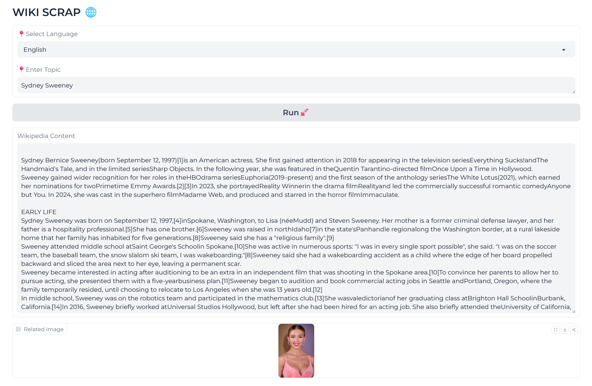

Check out the configuration reference at https://huggingface.co/docs/hub/spaces-config-reference


# WikiScrapper: A Simple Web Scraper for Wikipedia Articles

In the age of information, accessing accurate and relevant data quickly is more important than ever. Wikipedia, being one of the most extensive repositories of human knowledge, is often the go-to source for quick information on almost any topic. However, manually searching and sifting through Wikipedia content can be time-consuming, especially if you want to fetch specific data or images. 

That's where WikiScrapper comes in. It’s a simple, yet powerful, web scraper that allows you to extract content from Wikipedia articles in various languages and even fetch related images. Built using Python and Gradio, this tool is designed to be user-friendly, making it easy for anyone to retrieve Wikipedia content efficiently.

### Why WikiScrapper?

WikiScrapper is ideal for anyone who needs to quickly gather information on a specific topic from Wikipedia. Whether you're a student, researcher, or content creator, this tool saves you time by automating the content extraction process. It eliminates the need to navigate through multiple Wikipedia pages, allowing you to focus on what matters most—using the information.

### Key Features

- **Language Selection:** WikiScrapper supports multiple languages, making it accessible to a global audience. You can select your preferred language from a dropdown list, and the scraper will retrieve content from the corresponding Wikipedia version.

- **Topic Search:** Simply enter the topic you're interested in, and WikiScrapper will fetch the relevant Wikipedia content. The tool scrapes the main content of the article, focusing on headings and paragraphs to provide a clean, readable output.

- **Image Retrieval:** In addition to text, WikiScrapper can fetch images related to your topic from Google Images. This feature is particularly useful for visual content creators who need images that complement their textual data.

- **User-Friendly Interface:** Built with Gradio, WikiScrapper offers an intuitive interface that anyone can use without prior technical knowledge. The tool's design is minimalistic and easy to navigate, making the scraping process straightforward and efficient.

### How WikiScrapper Works

At its core, WikiScrapper leverages the `requests` library to make HTTP requests and `BeautifulSoup` to parse the HTML content of Wikipedia pages. The tool identifies and extracts relevant content, such as headings and paragraphs, from the main body of the Wikipedia article. For image retrieval, WikiScrapper performs a Google Image search based on the topic and downloads the first relevant image.

Here’s a brief overview of how WikiScrapper works:

1. **Language Selection:** The tool fetches available languages from Wikipedia’s homepage and displays them in a dropdown list.

2. **Content Scraping:** Upon entering a topic and selecting a language, WikiScrapper constructs the appropriate Wikipedia URL and scrapes the article content. It filters out unnecessary elements, providing you with clean, structured information.

3. **Image Fetching:** The tool conducts a Google Image search for the topic and downloads the first image that meets the criteria, saving it to your local machine.

### Building WikiScrapper: The Technical Side

WikiScrapper is built using the following technologies:

- **Python:** The core language used for scripting and handling web requests.
- **Gradio:** A Python library that allows you to create customizable user interfaces for machine learning models and other applications.
- **BeautifulSoup:** A Python library for parsing HTML and XML documents, used here for extracting text from Wikipedia pages.
- **Requests:** A simple HTTP library for making requests to websites and handling responses.

```
        url = f"https://{symbol}.wikipedia.org/wiki/{selected_topic}"
        response = requests.get(url)
        response.raise_for_status()
        soup = BeautifulSoup(response.content, 'html.parser')

 
        search_url = f"https://www.google.com/search?q={query}&tbm=isch"
        response = requests.get(search_url)
        response.raise_for_status()
        soup = BeautifulSoup(response.content, 'html.parser')

```

## Dependencies

| Package        | Version  | Description                                                                 |
|----------------|----------|-----------------------------------------------------------------------------|
| `beautifulsoup4` | 4.12.3   | A Python library for parsing HTML and XML documents, providing idiomatic ways of navigating, searching, and modifying the parse tree. |
| `requests`     | 2.32.3   | A simple and elegant HTTP library for Python, built for human beings.        |
| `gradio`       | Latest   | A user-friendly Python library for building machine learning and data science web apps.  |




### Conclusion

WikiScrapper is a handy tool for anyone who frequently uses Wikipedia for research or content creation. It streamlines the process of gathering information and images, allowing you to focus on analyzing and applying the data. With its multilingual support and user-friendly interface, WikiScrapper is a valuable addition to your digital toolkit.

Give WikiScrapper a try and see how it can simplify your information-gathering process!
